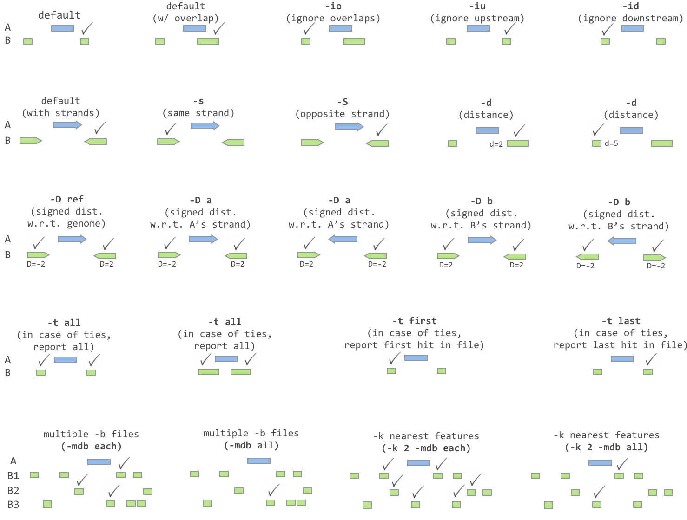

## How to get gene annotation data?

The [Table Browser](https://genome.ucsc.edu/cgi-bin/hgTables) is built on top of the UCSC Genome Browser database, which actually consists of several separate databases, one for each genome assembly. It also give you access to data from other databases and resources.
 It is essentially a tool for user to view and download data of their interest. You can consider it as BioMart to Ensembl.

You can follow the steps to retrieve your data:

1. Select your genome assembly --- Select by clade, genome and assembly

2. Select your dataset of interest--- Select by Group, track and table

3. Select suitable filter to your table --- Select by region, identifiers and filters.

    - If you have your gene list of interest, you can specify them in the identifiers. You can create your own filter to filter the output of your results.

4. Select advance setting --- Select by intersection and correlation

    - Intersection to see intersect of two tables; correlation to see similarity of two tables.

5. Select output --- Select by output format, output file and file type returned

  You can choose to output all or selected field from the table and also the output format. Also, renaming and gzip compressing are supported by table browser.

> ## Remember
> Please remember to click table schema to see whether the table you select contains the information that you want. Different tables from different resources may have different formats of data.
>
{: .callout}

If you should have any questions on using the Table Browser, you can refer to the [User's Guide](https://genome.ucsc.edu/goldenPath/help/hgTablesHelp.html)

## BED format

**BED** (Browser Extensible Data) format provides a flexible way to define the data lines that are displayed in an annotation track. BED lines have **three required fields** and nine additional optional fields. The number of fields per line must be consistent throughout any single set of data in an annotation track. The order of the optional fields is binding: lower-numbered fields must always be populated if higher-numbered fields are used.

The first three required BED fields are:
1. **chrom** - The name of the chromosome (e.g. chr3, chrY, chr2_random) or scaffold (e.g. scaffold10671).

2. **chromStart** - The starting position of the feature in the chromosome or scaffold. The first base in a chromosome is numbered 0.

3. **chromEnd** - The ending position of the feature in the chromosome or scaffold. The chromEnd base is not included in the display of the feature. For example, the first 100 bases of a chromosome are defined as chromStart=0, chromEnd=100, and span the bases numbered 0-99.

Based on the definition above, we can tell that the BED file of UCSC is a 0-based.

> ## 0-based VS. 1-based
> You might want to ask why we choose to used 0-based instead of 1-based.
>
> The advantage of storing features this way is that when computing the length of a feature, one must simply subtract the start from the end. Were the start position 1-based, the calculation would be (slightly) more complex (i.e. (end-start)+1). Thus, storing BED features this way reduces the computational burden.
>
{: .callout}

The 9 additional optional BED fields are:

4. name - Defines the name of the BED line. This label is displayed to the left of the BED line in the Genome Browser window when the track is open to full display mode or directly to the left of the item in pack mode.

5. score - A score between 0 and 1000. If the track line useScore attribute is set to 1 for this annotation data set, the score value will determine the level of gray in which this feature is displayed (higher numbers = darker gray).

6. strand - Defines the strand. Either "." (=no strand) or "+" or "-".

7. thickStart - The starting position at which the feature is drawn thickly (for example, the start codon in gene displays). When there is no thick part, thickStart and thickEnd are usually set to the chromStart position.

8. thickEnd - The ending position at which the feature is drawn thickly (for example the stop codon in gene displays).

9. itemRgb - An RGB value of the form R,G,B (e.g. 255,0,0). If the track line itemRgb attribute is set to "On", this RBG value will determine the display color of the data contained in this BED line. NOTE: It is recommended that a simple color scheme (eight colors or less) be used with this attribute to avoid overwhelming the color resources of the Genome Browser and your Internet browser.

10. blockCount - The number of blocks (exons) in the BED line.

11. blockSizes - A comma-separated list of the block sizes. The number of items in this list should correspond to blockCount.

12. blockStarts - A comma-separated list of block starts. All of the blockStart positions should be calculated relative to chromStart. The number of items in this list should correspond to blockCount.

## Using `bedtools` for annotation

In the previous tutorial, you have been introduced to `bedtools` for genome arithmetic. In this tutorial, we will be using `bedtools` to annotate peaks. This can be done using `bedtools closest`, as discussed below. 

## Bedtools closest

Similar to intersect, `closest` searches for overlapping features in A and B. In the event that no feature in B overlaps the current feature in A, closest will report the nearest (that is, least genomic distance from the start or end of A) feature in B. For example, one might want to find which is the closest gene to a significant GWAS polymorphism. Note that closest will report an overlapping feature as the closest—that is, it does not restrict to closest non-overlapping feature.

Usage:

bedtools closest [OPTIONS] -a <FILE> -b <FILE1, FILE2, ..., FILEN>

* Default behavior:

Report the feature that overlap with highest fraction of A
~~~
$ cat a.bed
chr1	10	20	a1	1	-

$ cat b.bed
chr1	15	20	b1	1	+
chr1	25	30	b2	2	-

$ bedtools closest -a a.bed -b b.bed
chr1	10	20	a1	1	-	chr1	15	20	b1	1  +
~~~
{: .bash}

Report the closest when no overlap
~~~
$ cat a.bed
chr1	10	20	a1	1	-

$ cat b.bed
chr1	2	  5	  b1	1	+
chr1	25	30	b2	2	-

$ bedtools closest -a a.bed -b b.bed
chr1	10	20	a1	1	-	chr1	2	  5	  b1	1  +
chr1	10	20	a1	1	-	chr1	25	30	b2	2  -
~~~
{: .bash}

* Ignoring overlapping features:

-io: Ignoring overlapping features

~~~
$ cat a.bed
chr1	10	20	a1	1	-

$ cat b.bed
chr1	15	20	b1	1	+
chr1	25	30	b2	2	-

$ bedtools closest -io -a a.bed -b b.bed
chr1	10	20	a1	1	-	chr1	25	30	b2	2  -
~~~
{: .bash}

* Require strandness:

-s: Report the closest only when they are on the same strand

* Report ties:

-t

~~~
$ cat a.bed
chr1	10	20	a1	1	-

$ cat b.bed
chr1	2	  5	  b1	1	+
chr1	25	30	b2	2	-

# Report the first one
$ bedtools closest -t first -a a.bed -b b.bed
chr1	10	20	a1	1	-	chr1	2	  5	  b1	1  +

# Report the last one
$ bedtools closest -t last -a a.bed -b b.bed
chr1	10	20	a1	1	-	chr1	25	30	b2	2  -

# Report all
$ bedtools closest -t all -a a.bed -b b.bed
chr1	10	20	a1	1	-	chr1	2	  5	  b1	1  +
chr1	10	20	a1	1	-	chr1	25	30	b2	2  -
~~~
{: .bash}

* Report distance:

-d: Report the distance to the closest feature in base pair

~~~
$ cat a.bed
chr1	10	20	a1	1	-

$ cat b.bed
chr1	2	  5	  b1	1	+
chr1	25	30	b2	2	-

$ bedtools closest -d -a a.bed -b b.bed
chr1	10	20	a1	1	-	chr1	2	  5	  b1	1  +	6
chr1	10	20	a1	1	-	chr1	25	30	b2	2  -	6
~~~
{: .bash}

-D: Reporting signed distances to the closest feature in base pairs

Whereas the -d option always reports distances as positive integers, the -D option will use negative integers to report distances to “upstream” features. There are three options for dictating how “upstream” should be defined.

`-D ref`: Report distance with respect to the reference genome. That is, B features with lower start/stop coordinates are considered to be upstream.

`-D a`: Report distance with respect to the orientation of the interval in A. That is, when A is on the - strand, “upstream” means B has higher start/stop coordinates. When A is on the + strand, “upstream” means B has lower start/stop coordinates.

`-D b`: Report distance with respect to the orientation of the interval in B. That is, when B is on the - strand, “upstream” means A has higher start/stop coordinates. When B is on the + strand, “upstream” means A has lower start/stop coordinates.

> ## Exercise
>
> 1. Take your peak file, try to find out those genes that overlap with these peaks. For those without overlap, also report them in the output file. That is, you should have a output with same line number as the input.( bedtools intersect)
>
> 2. For those peaks that not overlap with any genes, try to find out the closest gene to it and the distance between them. (bedtools closest)
>
> > ## Hint
> >
> > 1. bedtools intersect -loj -a Peak_file -b refGene.bed > Output
> >
> > 2. bedtools closest -io -d -a Peak_file -b refGene.bed > Output
> >
> {: .solution}
{: .challenge}
