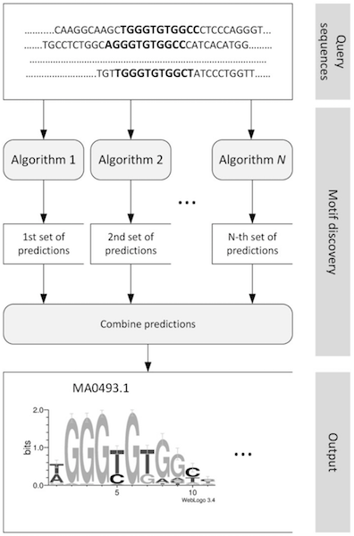
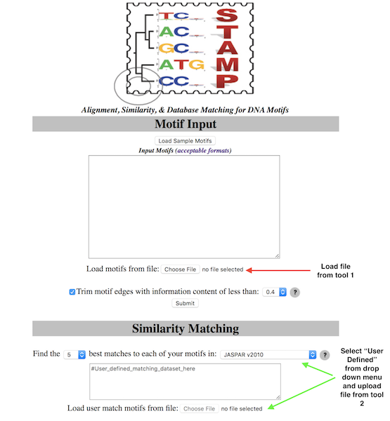
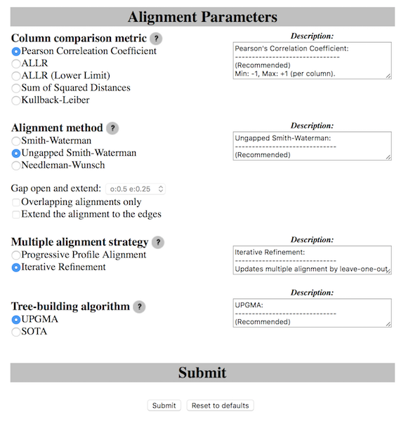
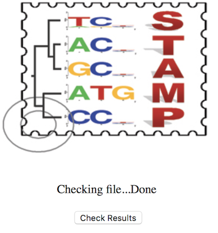
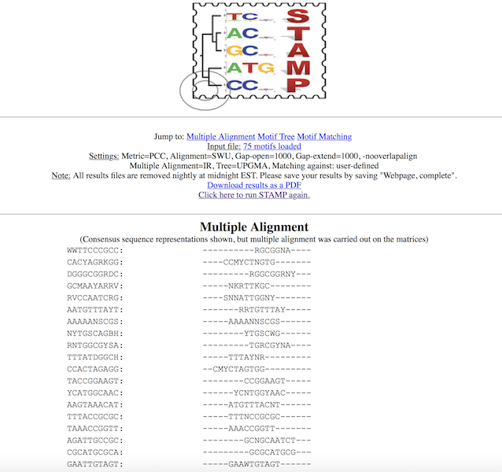
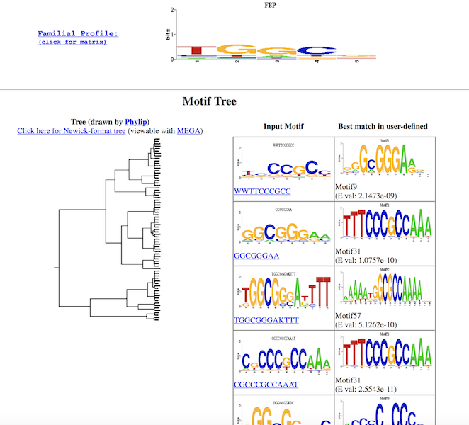
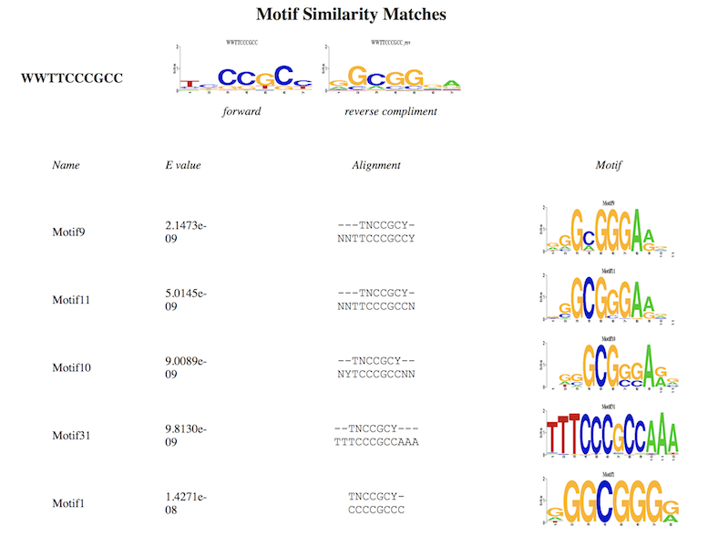

# What is motif discovery?

> "Motif analysis is useful for much more than just identifying the causal DNA-binding motif in TF ChIP-seq peaks. When the motif of the ChIPed protein is already known, motif analysis provides validation of the success of the experiment. Even when the motif is not known beforehand, identifying a centrally located motif in a large fraction of the peaks by motif analysis is indicative of a successful experiment. Motif analysis can also identify the DNA-binding motifs of other proteins that bind in complex or in conjunction with the ChIPed protein, illuminating the mechanisms of transcriptional regulation. Motif analysis is also useful with histone modification ChIP-seq because it can discover unanticipated sequence signals associated with such marks."
>
> Excerpt from Bailey T, Krajewski P, Ladunga I, Lefebvre C, Li Q, Liu T, et al. (2013) **Practical Guidelines for the Comprehensive Analysis of ChIP-seq Data.** PLoS Comput Biol 9(11): e1003326. doi:10.1371/journal.pcbi.1003326

## HOMER

First things first, let's create a folder for HOMER to live in.

> ~~~
> cd ~
> mkdir HOMER/
> cd HOMER/
> ~~~~
{: .bash}

Now download the file and save it into HOMER/ folder.

[configureHomer.pl](http://homer.ucsd.edu/homer/configureHomer.pl)

And now we run the configureHomer.pl file

> ~~~
> perl configureHomer.pl -install
> ~~~
{: .bash}

At the end of the installation, configureHomer.pl will ask you to add a line to your .bashrc or .bash_profile file. The line will look something like this:

> ~~~
> PATH=$PATH:/path/to/HOMER/.//bin/
> ~~~
{: .source}

> ## Let's do this! 
>
> open your .bashrc or .bash_profile file using your favourite text editor
>
> Put the line in your file: 
>
> ~~~
> export PATH=$PATH:/path/to/HOMER/.//bin/
> ~~~
>{: .source}
>
> save your file and then reload the .bashrc file by typing:
>
> ~~~
> source .bashrc
> ~~~
> {: .source}
{: .challenge}

After we've installed HOMER we can run the findMotifsGenome.pl

> ~~~
> findMotifsGenome.pl NAME_peaks.bed /path/to/hg19.fa MotifOutput/ -size 200 -mask
> ~~~
{: .bash}

And now we can look at the outputs produced by findMotifsGenome.pl by looking in our MotifOutput/ directory. You will notice a bunch of files and two folders homerResults/ and knownResults/. homerResults/ will contain all the files required to generate the homerResults.html and this corresponds to the de novo discovery of motifs. knownResults/ will contain all the files required to generate knownResults.html and will correspond to the enrichment of known motifs. 

[homerResults.html](../files/homerResults.html)
[knownResults.html](../files/knownResults.html)

The list of discovered motifs will be contained in the file homerMotifs.all.motifs.

> ## Let's see what's inside 
>
> ~~~
> >WWTTCCCGCC	1-WWTTCCCGCC	5.364976	-1727.061690	0	T:11926.0(46.44%),B:7159.6(29.07%),P:1e-750	Tpos:99.7,Tstd:51.6,Bpos:97.4,Bstd:64.0,StrandBias:0.0,Multiplicity:1.36
> 0.408	0.140	0.152	0.300
> 0.292	0.155	0.174	0.379
> 0.112	0.131	0.221	0.536
> 0.071	0.211	0.105	0.613
> 0.100	0.536	0.169	0.195
> 0.022	0.770	0.176	0.032
> 0.026	0.736	0.192	0.046
> 0.046	0.042	0.715	0.197
> 0.015	0.800	0.173	0.012
> ~~~
> {: .source} 
{: .solution}

# Ensemble methods for motif discovery

There are many many motif discovery tools out there. All utilising different algorithms and will have varying outputs. It is best to use a number of tools together and to find the top hits that can be found from those methods. 

Taken from 
[Andrei Lihu, Stefan Holban; A review of ensemble methods for de novo motif discovery in ChIP-Seq data . Brief Bioinform 2016; 17 (4): 731. doi: 10.1093/bib/bbw047](https://academic.oup.com/bib/article/17/4/731/1742437/A-review-of-ensemble-methods-for-de-novo-motif)

# Comparison of results and top result selection: STAMP

A way to find common motifs discovered by your different tools would be to use [STAMP](http://www.benoslab.pitt.edu/stamp/). 

> ## Here is one I prepared earlier
>
> [MEME-Chip output](../files/combined.meme)
{: .challenge}

> ## Take note
>
> Unless you really know what your looking for keep the options to default!
{: .callout}

Click the "Check Results" button and it will bring you to a results page. You can then save the html page and download the PDF. Let's look at the output.

#### Multiple alignment:

#### Tree diagram:

#### Details of similar motifs from the two datasets:
 

# If your interested to know more about motif discovery

[Review of ensemble based motif discovery tools](https://academic.oup.com/bib/article/17/4/731/1742437/A-review-of-ensemble-methods-for-de-novo-motif)

[Review of web based tools for motif discovery](https://biologydirect.biomedcentral.com/articles/10.1186/1745-6150-9-4)

[Limitations of De novo motif discovery](http://journals.plos.org/plosone/article?id=10.1371/journal.pone.0047836)

